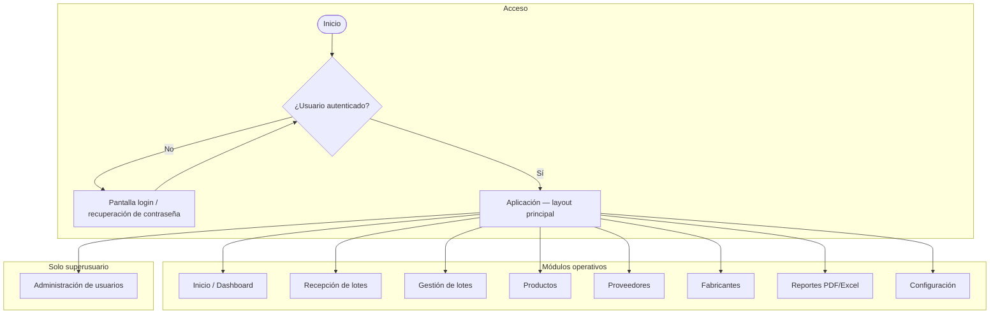
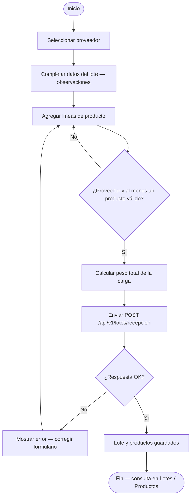
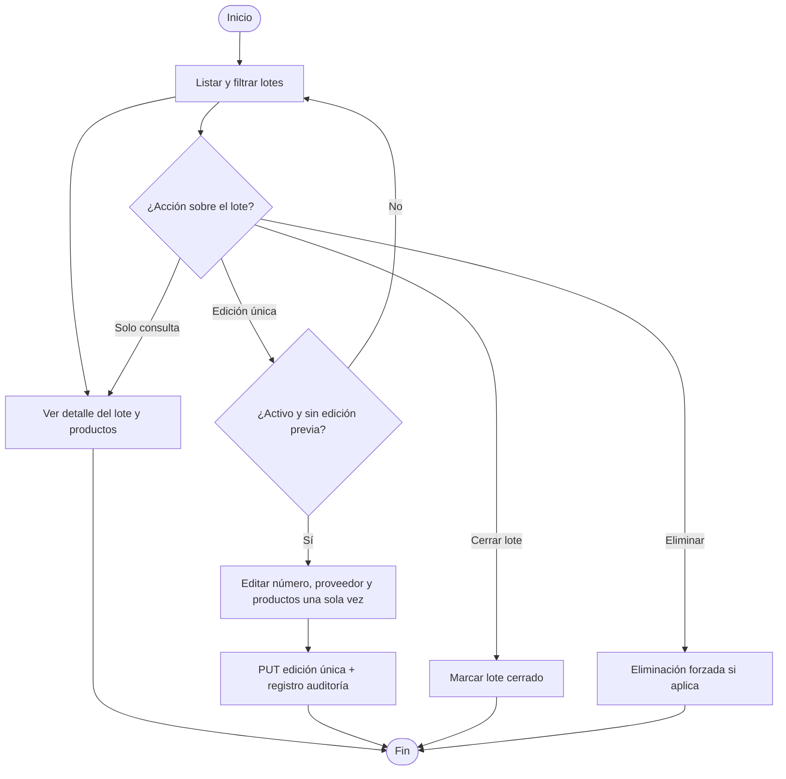

# Ficha y mapa de procesos — PDVAL (pyllren)

Sistema de **inventario de almacén** (SPA React + API FastAPI): registro de cargas por lote, catálogo de productos, proveedores y fabricantes, reportes y administración de usuarios.

## 1. Alcance y actores

| Actor | Rol en el proceso |
|-------|-------------------|
| Usuario operativo | Recepciona lotes, consulta lotes/productos, gestiona proveedores/fabricantes según permisos. |
| Administrador (superusuario) | Alta/edición de usuarios y alcance; acceso completo a módulos. |
| Sistema | Valida JWT, aplica reglas de negocio (edición única de lote, cierre, auditoría). |

## 2. Mapa macro (navegación)

Archivo fuente: [`mapa-macro-flujo.mmd`](./mapa-macro-flujo.mmd).

## 3. Flujo — Recepción de lotes

Archivo fuente: [`flujo-recepcion-lote.mmd`](./flujo-recepcion-lote.mmd).

## 4. Flujo — Gestión de lotes

Archivo fuente: [`flujo-gestion-lotes.mmd`](./flujo-gestion-lotes.mmd).

## 5. Referencia rápida de módulos (frontend)

Definición del menú: `frontend/src/components/Common/SidebarItems.tsx`. Rutas bajo `frontend/src/routes/_layout/`.

| Módulo | Descripción breve |
|--------|-------------------|
| Inicio | Resumen y estadísticas. |
| Recepción de lotes | Alta de lote con líneas de producto. |
| Lotes | Listado, detalle, edición única, cierre. |
| Productos | Catálogo y stock por producto. |
| Proveedores | ABM de proveedores. |
| Fabricantes | ABM de fabricantes. |
| Reportes | Exportación PDF/Excel. |
| Configuración | Preferencias de usuario. |
| Administración | Usuarios (solo superusuario). |

## 6. Cómo visualizar los diagramas

- **Mermaid Live Editor**: pegar el contenido de los `.mmd` en [https://mermaid.live](https://mermaid.live).
- **VS Code / Cursor**: extensión “Mermaid” o vista previa Markdown de este archivo.
- **Secuencias técnicas** (API, transacciones): `diagrams/sequences/`.
